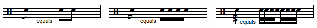
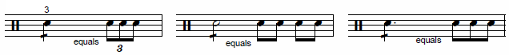
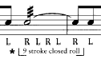
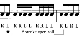
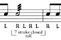
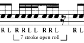

Source: [Wikipedia](https://en.wikipedia.org/wiki/Drum_rudiment)

* single stroke rudiments
* multiple bounce rudiments
* diddle
* paradiddle
* drag
* flame
* roll

## Roll

* Open roll = rudimental roll of two beats (no more) of each stick (from Stick Control)
* Closed roll = several rebounds to each stick movement. Produced by a slight additional pressure applied to the sticks.

Rolls are notated as tremolos, with slashes through the note stem. Each slash indicates dividing the note in two.

And for longer notes

or

More info available in the [notation guide](http://web.mit.edu/merolish/Public/drums.pdf). Also, there is a difference in how the rolls are played depending on the tie between the notes:

| head                                                                  | other        |                                                                    |
| --------------------------------------------------------------------- | ------------ | ------------------------------------------------------------------ |
|  | is played as |  |
|  | is played as |  |

in terms of the roll length (not the number of notes comprising the roll itself).

Videos: buzz roll ([link](https://www.youtube.com/watch?v=kyiZMFSlK6Y)).